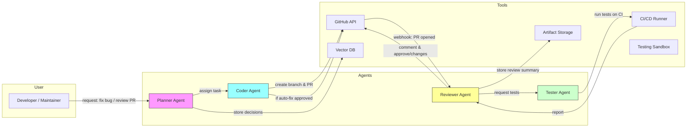

# Multi-Agent GitHub Code Reviewer

> **Project**: Multi-Agent GitHub Code Reviewer

A proof-of-concept agentic system that automates code review workflows on GitHub using a team of specialized agents: **Planner**, **Coder**, **Reviewer**, and **Tester**. The system demonstrates tool-enabled agents calling the GitHub API, running tests, and producing structured, actionable PR comments — optionally creating fix PRs.

---

## Architecture (Diagram)

Below is a Mermaid diagram showing the high-level architecture and interactions between components. You can paste this into GitHub README or a mermaid-capable viewer to render the diagram.



---

## Components

### Planner Agent

* Receives high-level requests (e.g., "Improve failing tests for PR #42" or "Refactor auth flow").
* Decomposes tasks into ordered subtasks.
* Decides which agents to call and in what sequence.
* Uses the Vector DB to store and retrieve planning context and past decisions.

### Coder Agent

* Produces code changes or patches.
* Creates branches and opens PRs via the GitHub API.
* Uses repository context, code search, and tests to produce minimal, targeted changes.
* Produces structured output (JSON) containing `files_changed`, `patch`, `tests_added`.

### Reviewer Agent

* Reads diffs and test outputs.
* Generates review comments and suggestions in structured format.
* Can optionally propose a rollback or request more tests.
* Uses guardrails to avoid unsafe recommendations (e.g., secrets removal, credential changes).

### Tester Agent

* Executes test suites inside an isolated environment (CI runner or sandbox).
* Reports back pass/fail with logs.
* Can run linters, static analysis, and security scans.

### Tooling

* **GitHub API** for branches, PRs, comments, and webhooks.
* **CI Runner** (GitHub Actions or self-hosted) to execute tests.
* **Vector DB** (FAISS/Chroma/Pinecone) to store embeddings for repo docs, code search, and past reviews.
* **Artifact Storage** (S3) for large outputs and logs.

---

## Features

* Automatic PR reading & structured review outputs
* Optionally open auto-fix PRs after tests and human approval
* Memory: stores past decisions and review summaries for context
* Pluggable tools: add custom tools (linters, security scanners, style-formatters)
* Safety: built-in guardrails for destructive actions

---

## Quickstart — Local Development

> Prereqs: Python 3.10+, Git, Node (optional for UI), Docker (for sandboxed tests)

1. Clone repository

```bash
git clone git@github.com:your-org/multi-agent-code-reviewer.git
cd multi-agent-code-reviewer
```

2. Create .env file (example below)

```env
GITHUB_TOKEN=ghp_xxx
GITHUB_APP_ID=12345
GITHUB_PRIVATE_KEY_PATH=./keys/app.pem
VECTOR_DB_URL=http://localhost:8000
S3_BUCKET=agent-artifacts
CI_RUNNER_URL=http://localhost:9999
```

3. Install dependencies (Python)

```bash
python -m venv .venv
source .venv/bin/activate
pip install -r requirements.txt
```

4. Start local services (vector DB, sandboxed test runner)

```bash
docker compose up -d
```

5. Run the agent backend

```bash
uvicorn app.main:app --reload
```

6. Configure GitHub webhook pointing to `/webhook/github` on your dev server.

### GitHub Token / Permissions

- Respository (aka. repo)
  - Contents (Read & Write)
  - Pull requests (Read & Write)
  - Issues or Pull request reviews (Read & Write)
---

## Example: Opening a Review Request (HTTP)

`POST /v1/request-review`

Payload:

```json
{
  "type": "review_pr",
  "repo": "your-org/your-repo",
  "pr_number": 42,
  "requester": "alice@example.com",
  "priority": "high",
  "instructions": "Focus on security and failing tests."
}
```

Response (example):

```json
{
  "request_id": "req_abc123",
  "status": "queued",
  "assigned_agents": ["Reviewer", "Tester"]
}
```

---

## Safety & Guardrails

* **Action whitelists**: Agents can only perform actions enumerated in the `actions.json` allowlist.
* **Human-in-the-loop**: For production, auto-merge and auto-fix PR creation are gated behind manual approval.
* **Input sanitization**: All retrieved files and diffs are sanitized before passing to models.
* **Rate limiting & quotas**: Prevent runaway agents from spamming APIs or opening many PRs.
* **Audit logs**: Every agent decision and API call is logged with correlation IDs for forensic review.

---

## Testing Strategy

* Unit tests for business logic
* Integration tests that mock GitHub and Vector DB
* End-to-end tests using a temporary test repository and GitHub Actions
* Simulation harness: replay past PRs and evaluate agent comments vs human comments

---

## Evaluation Metrics

* **Precision of suggestions**: % of suggested changes accepted by humans
* **False positive rate**: suggestions that are incorrect or harmful
* **Time-to-first-useful-comment**: latency from PR open -> first meaningful comment
* **Test pass rate for auto-fixes**

---

## CI / Deployment

* Use GitHub Actions to run tests and build the Docker image
* Recommend a Kubernetes cluster or Fargate for production
* Use Secrets Manager (AWS) or GitHub Secrets for credentials

Sample GitHub Actions snippet (build + test):

```yaml
name: CI
on: [push, pull_request]
jobs:
  test:
    runs-on: ubuntu-latest
    steps:
      - uses: actions/checkout@v4
      - name: Set up Python
        uses: actions/setup-python@v4
        with:
          python-version: '3.10'
      - name: Install
        run: |
          python -m pip install -r requirements.txt
      - name: Run tests
        run: pytest -q
```

---

## Prompts & Structured Output Examples

**Planner instruction (system prompt)**

```
You are the Planner Agent. Given a high-level request, decompose it into an ordered list of subtasks and assign each to an agent (Coder, Reviewer, Tester). Return JSON with fields: { "plan_id": "", "tasks": [{"id":"","agent":"","instruction":"","priority":""}], "context_references": [] }
```

**Coder output schema**

```json
{
  "files_changed": ["src/foo.py"],
  "patch": "@@ -1,4 +1,8 @@...",
  "branch": "agent/auto-fix-123",
  "pr_body": "Automated fix for failing test..."
}
```

**Reviewer comment schema**

```json
{
  "summary": "High-level summary",
  "comments": [{"file":"src/foo.py","line":45,"comment":"Consider using X for performance","severity":"suggestion"}],
  "approve": false
}
```

---

## Roadmap / Next Steps

* Add role-based permissioning (allowlist per repo)
* Add more tooling (SAST, dependency checks)
* Improve memory: embed past human decisions for context
* Add UI dashboard to review agent suggestions and audit logs

---

## Contributing

1. Fork the repo
2. Create a feature branch
3. Open a PR with a clear description and tests

Please follow the coding style defined in `.editorconfig` and run linters before submitting.

---

## License

MIT — see LICENSE file.